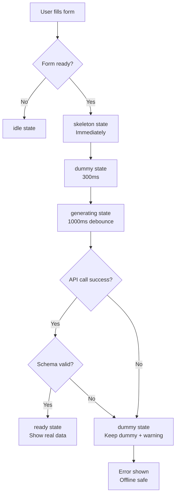

# Safe OPS Studio

Transform accident overviews into comprehensive OPS briefs with law mappings, root causes, prevention checklists, and shareable pages.

## Tech Stack

- **Frontend**: Next.js (Pages Router) + Tailwind CSS + shadcn/ui
- **Backend**: Cloudflare Workers
- **Database**: Cloudflare D1 (SQLite)
- **Cache**: Cloudflare KV
- **Email**: Resend/Mailgun (REST API)
- **PDF**: html2pdf.js (client-side)
- **Testing**: Jest + Miniflare (unit/integration), Playwright (E2E)
- **Deployment**: Cloudflare Pages + Wrangler CLI

## Project Structure

```
/
├── apps/
│   ├── web/                    # Next.js frontend
│   │   ├── pages/             # Pages Router
│   │   ├── components/        # React components
│   │   ├── styles/           # Tailwind CSS
│   │   └── tests/            # Frontend tests
│   └── workers/               # Cloudflare Workers API
│       ├── src/
│       │   ├── subscriptions/ # Email subscription domain
│       │   ├── ops/          # OPS document domain
│       │   ├── law/          # Law mapping domain
│       │   ├── delivery/     # Email delivery domain
│       │   ├── db/           # D1 database access
│       │   ├── cache/        # KV cache access
│       │   └── utils/        # Shared utilities
│       ├── migrations/       # D1 migrations
│       └── tests/            # Worker tests
├── scripts/                   # DB seeding, utilities
└── vooster-docs/             # Project documentation
```

## Getting Started

### Prerequisites

- Node.js 18+
- npm or yarn

### Installation

1. Clone the repository
2. Install dependencies:

```bash
# Install web dependencies
cd apps/web
npm install

# Install workers dependencies
cd ../workers
npm install
```

### Development

```bash
# Start Next.js dev server
cd apps/web
npm run dev

# Start Workers dev server (in another terminal)
cd apps/workers
npm run dev
```

### Database Setup

The D1 database is already configured:
- **Database ID**: `4409b768-3430-4d91-8665-391c977897c7`
- **KV Namespace ID**: `03757fc4bf2e4a0e99ee6cc7eb5fa1ad`

Tables created:
- `subscribers` - Email subscription list
- `ops_documents` - OPS documents
- `deliveries` - Email delivery logs
- `law_rules` - Law keyword mappings

## Development Workflow

This project follows **Test-Driven Development (TDD)**:
1. **RED**: Write failing test first
2. **GREEN**: Write minimal code to pass
3. **REFACTOR**: Clean up while keeping tests green

## OPS Builder Preview Flow

The OPS Builder implements a **skeleton → dummy → real data** preview system to ensure users always see something in the preview area:

### State Machine

```
idle → skeleton → dummy → generating → ready/error
```

### Flow Diagram



### Implementation Details

#### 1. **Zod Schema Validation** (`apps/web/lib/schemas/ops.ts`)
- Type-safe OPS document structure
- Validates all API responses
- Ensures preview data consistency
- Provides helpful error messages

#### 2. **Dummy Data Generator** (`apps/web/lib/dummy-ops.ts`)
- Generates realistic preview data instantly
- Type-specific fallbacks (추락, 화학, 화재, etc.)
- Combines partial form data with smart defaults
- Offline safety net when API fails

#### 3. **Preview Component** (`apps/web/components/Preview.tsx`)
- Five states: idle, skeleton, dummy, generating, ready, error
- Skeleton loaders with Tailwind animations
- Status indicators (⏱️ AI 분석 중, ✓ 생성 완료, etc.)
- Smooth transitions between states

#### 4. **Builder Integration** (`apps/web/pages/builder.tsx`)
- Two timers: 300ms (dummy) + 1000ms (real data)
- `isFormReadyForPreview()` checks minimum required fields
- Falls back to dummy data on API/network errors
- Schema validation ensures data quality

### User Experience

| Time | State | User Sees |
|------|-------|-----------|
| 0ms | Skeleton | Animated loading bars |
| 300ms | Dummy | Realistic preview with form data |
| 1000ms | Generating | AI analysis indicator |
| ~3000ms | Ready | Real AI-generated content |

### Offline Safety

Even when offline or API fails, users get:
- ✅ Dummy preview based on form input
- ✅ Warning message about offline mode
- ✅ Ability to continue editing
- ✅ Can still see structured preview

### Testing Fixtures

- `apps/web/fixtures/ops_sample.json` - Complete OPS example
- Used for reference and testing
- Demonstrates expected data structure

## Illustration System

Safe OPS Studio includes a **deterministic SVG illustration system** for accident scenarios:

### Key Features

- ✅ **100% Deterministic**: Same input → same SVG output
- ✅ **7 Accident Types**: 추락, 끼임, 감전, 화재, 화학물질, 폭발, 전도/붕괴
- ✅ **Transparent PNG Export**: Download with alpha channel preserved
- ✅ **No External Fonts**: Uses system fonts only
- ✅ **Auto Text Wrapping**: Maximum 2 lines per field
- ✅ **Watermarked**: "Generated by Safe OPS Studio"
- ✅ **Consistency Badge**: "✓ 그림 일관성 보장"

### Components

```
apps/web/
├── components/ops/
│   ├── Illustration.tsx           # Main illustration component
│   └── icons/                     # SVG icon templates
│       ├── FallIcon.tsx          # 추락
│       ├── CaughtIcon.tsx        # 끼임
│       ├── ElectricIcon.tsx      # 감전
│       ├── FireIcon.tsx          # 화재
│       ├── ChemicalIcon.tsx      # 화학물질
│       ├── ExplosionIcon.tsx     # 폭발
│       └── CollapseIcon.tsx      # 전도/붕괴
├── utils/
│   └── svg-export.ts             # SVG→PNG conversion
└── pages/
    └── illustration-demo.tsx      # Demo page
```

### Usage Example

```tsx
import Illustration from '@/components/ops/Illustration';

const scenario = {
  incidentType: '추락',
  location: '서울시 강남구 건설현장 A동 3층',
  hazardObject: 'A형 사다리',
  agentObject: '작업 발판',
  ppe: ['안전모', '안전벨트', '안전화'],
};

<Illustration
  scenario={scenario}
  width={600}
  height={400}
  showDownloadButton={true}
/>
```

### Demo Page

View all 7 accident type illustrations:

```bash
cd apps/web
npm run dev
# Visit http://localhost:3000/illustration-demo
```

### Documentation

- **Detailed Guide**: `apps/web/ILLUSTRATION_GUIDE.md`
- **Snapshot Capture**: `docs/illustration-snapshots-guide.md`
- **API Reference**: See ILLUSTRATION_GUIDE.md for full API documentation

## Export System

Safe OPS Studio supports exporting OPS documents in **3 formats**:

### Supported Formats

1. **PDF** - Professional documents with A4 pages, watermark, and document hash
2. **Markdown** - Text-based format for version control and editing
3. **Docx** - Microsoft Word compatible (also works with Korean Hangul)

### Key Features

- ✅ **Client-side generation** - No server costs
- ✅ **Watermarked outputs** - Tool name and document hash
- ✅ **Korean support** - Full Korean text in Markdown/Docx, limited in PDF
- ✅ **Law appendix** - Optional law suggestions section
- ✅ **Consistent structure** - Same content across all formats

### Usage

```tsx
import ExportMenu from '@/components/ExportMenu';
import { OPSExportData } from '@/utils/exporters';

<ExportMenu
  data={opsData}
  onExportComplete={(format) => console.log(`${format} exported`)}
/>
```

### Test Page

```bash
cd apps/web
npm run dev
# Visit http://localhost:3000/test-export
```

### Documentation

- **Complete Export Guide**: `EXPORT_FORMATS.md`
- **Sample Data**: `apps/web/utils/exporters/sample-data.ts`
- **Implementation**: `apps/web/utils/exporters/`

## Contributing

Please follow the guidelines in `CLAUDE.md` and `vooster-docs/`.

## License

Private project - All rights reserved
