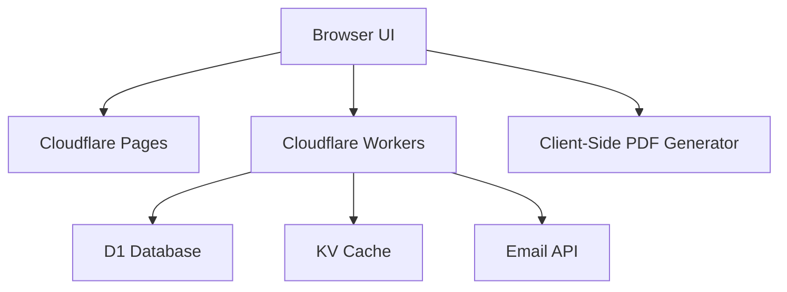

# Technical Requirements Document (TRD)

## 1. Executive Technical Summary
- **Project Overview**  
  Safe OPS Studio delivers a one-page OPS brief from a short accident overview. The solution uses Cloudflare Free (Pages + Workers + D1 + KV), a Next.js frontend, TDD workflows, and client-side PDF generation to meet 30-day feasibility and privacy-first principles.
- **Core Technology Stack**  
  Next.js (React) + Tailwind + shadcn/ui for UI; Cloudflare Workers for API; D1 (SQLite) for relational data; KV for caching; REST email API (Resend/Mailgun).
- **Key Technical Objectives**  
  • First OPS in ≤10 min end-to-end  
  • ≥70% law-suggestion hit-rate from curated rules  
  • Client-side PDF render ≤5 s on common devices  
  • Email API success ≥98%
- **Critical Technical Assumptions**  
  • OPS rules engine (keyword→law) is primary; optional AI supplement  
  • No binary storage in MVP; client-side PDF only  
  • Admin authentication via simple access key or magic link  
  • Cloudflare Free limits guide architecture (Pages + Workers, D1 + KV)

## 2. Tech Stack

| Category           | Technology / Library      | Reasoning                                                         |
| ------------------ | ------------------------- | ----------------------------------------------------------------- |
| Frontend Framework | Next.js                   | SSR/SSG support, integration with Cloudflare Pages, developer DX  |
| UI Styling         | Tailwind CSS + shadcn/ui  | Utility-first, rapid UI composition, accessible components        |
| API Layer          | Cloudflare Workers        | Free tier HTTP APIs, minimal cold start, edge proximity          |
| Relational Store   | D1 (SQLite)               | Free, serverless, relational for subscribers, OPS, deliveries     |
| Cache Store        | Cloudflare KV             | Low-latency immutable caching for public OPS JSON                 |
| Email Delivery     | Resend (or Mailgun)       | Simple REST API, high deliverability, free/low-cost tiers         |
| PDF Generation     | html2pdf.js               | Client-side, no server costs, fast single-page PDF                |
| Testing Framework  | Jest + Miniflare          | Worker unit tests, D1 integration mocks                          |
| E2E Testing        | Playwright                | Cross-browser flows, mobile emulation                             |
| Deployment         | Cloudflare Pages + Wrangler CLI | GitHub integration, automated preview & production deployments     |

## 3. System Architecture Design

### Top-Level Building Blocks
- **Static/UI Hosting**  
  - Next.js Pages deployed on Cloudflare Pages  
  - Public OPS pages served via SSG/SSR  
- **API Layer**  
  - Cloudflare Workers expose JSON endpoints (/api/subscribe, /api/ops, /api/send, /api/law)  
  - Authentication via access key header  
- **Data Stores**  
  - D1 (SQLite) for subscribers, OPS docs, law rules, deliveries  
  - KV for caching published OPS JSON  
- **Email Service**  
  - REST calls to transactional email provider  
- **Client-Side Utilities**  
  - html2pdf.js for PDF export  
  - SVG fallback illustration library

### Top-Level Component Interaction Diagram


- Browser UI fetches static assets from Cloudflare Pages.  
- Browser UI invokes Workers for subscription, OPS creation, publishing, sending.  
- Workers read/write relational data to D1 and cache public OPS JSON in KV.  
- Workers call external Email API for sending link-only emails.  
- Browser triggers html2pdf.js for client-side PDF generation.

### Code Organization & Convention

**Domain-Driven Organization Strategy**  
- **Domain Separation**:  
  - subscription, ops, law, delivery  
- **Layer-Based Architecture**:  
  - presentation (Next.js pages/components)  
  - service (Workers handlers)  
  - data access (D1/KV wrappers)  
- **Feature-Based Modules**:  
  - each domain in its own folder with related handlers, models, tests  
- **Shared Components**:  
  - UI atoms, types, utils, HTTP client, email client

**Universal File & Folder Structure**
```
/
├── apps
│   ├── web                     # Next.js frontend
│   │   ├── pages
│   │   ├── components
│   │   ├── styles
│   │   └── tests
│   └── workers                 # Cloudflare Workers
│       ├── src
│       │   ├── subscriptions
│       │   ├── ops
│       │   ├── law
│       │   ├── delivery
│       │   ├── db
│       │   ├── cache
│       │   └── utils
│       └── tests
├── scripts                      # DB migrations, seeding
├── .github
│   └── workflows                # CI/CD pipelines
└── README.md
```

### Data Flow & Communication Patterns
- **Client-Server Communication**:  
  JSON REST over HTTPS; Next.js fetch/xhr from Workers endpoints.
- **Database Interaction**:  
  Use D1’s built-in query interface; simple parameterized SQL or ORM-lite wrapper.
- **External Service Integration**:  
  Email API client wraps REST calls with retries; secrets in Worker env.
- **Real-time Communication**:  
  Not required; no WebSocket or SSE planned in MVP.
- **Data Synchronization**:  
  Immutable public OPS JSON cached in KV on publish; stale-safe for read.

## 4. Performance & Optimization Strategy
- Cache public OPS JSON in KV with TTL = ∞ (invalidate only on update) to minimize D1 reads.  
- Bundle and Tree-shake Next.js output; enable gzip/Brotli on Pages.  
- Lazy-load large UI components (illustration editor, settings) only when needed.  
- Use client-side PDF library to offload rendering from server; inline small font subsets.

## 5. Implementation Roadmap & Milestones

### Phase 1: Foundation (MVP Implementation)
- Core Infrastructure: Cloudflare Pages + Workers + D1 + KV setup  
- Essential Features: Landing subscription, OPS input & preview, law rules engine, publish/share  
- Basic Security: Access key protection, input validation  
- Development Setup: GitHub Actions for unit/integration tests, Wrangler CI  
- Timeline: Week 1

### Phase 2: Feature Enhancement
- Advanced Features: Minimal ops history, resend logs, manual weekly digest trigger  
- Performance Optimization: KV caching, HTTP response compression  
- Enhanced Security: Rate-limiting on APIs, input sanitization  
- Monitoring Implementation: Basic logs (Workers), error reporting (Sentry)  
- Timeline: Week 2–3

### Phase 3: Scaling & Optimization
- Scalability Implementation: Optimize D1 queries, consider sharding rules if needed  
- Advanced Integrations: Optional AI illustration API with rate-limits  
- Enterprise Features: Role-based ACL, SSO (post-MVP)  
- Compliance & Auditing: Audit logs for OPS changes and sends  
- Timeline: Week 4

## 6. Risk Assessment & Mitigation Strategies

### Technical Risk Analysis
- **Law Accuracy**:  
  • Risk: Poor keyword mapping yields low hit-rate  
  • Mitigation: Manual review checkbox; seed curated rules, iterate weekly
- **Performance Bottlenecks**:  
  • Risk: D1 cold-start or high latency  
  • Mitigation: Cache with KV; optimize SQL; cold starts limited on free tier
- **Email Reliability**:  
  • Risk: API outages or 4xx errors  
  • Mitigation: Retry logic; delivery logs; fallback resend UI
- **Client-side PDF Issues**:  
  • Risk: Browser memory/timeouts on mobile  
  • Mitigation: Simple layout; small asset footprint; test on target devices

### Project Delivery Risks
- **Timeline Risks**:  
  • Risk: Overrun due to unplanned complexity  
  • Mitigation: Strict MVP scope, weekly demos, TDD gating
- **Resource Risks**:  
  • Risk: Limited Cloudflare Free constraints  
  • Mitigation: Optimize for free tier; avoid server-side PDF or heavy compute
- **Quality Risks**:  
  • Risk: Insufficient test coverage  
  • Mitigation: Enforce unit/integration/e2e tests in CI before merge
- **Deployment Risks**:  
  • Risk: Env misconfiguration, secret leaks  
  • Mitigation: Use Wrangler secrets, preview environments, branch protection

